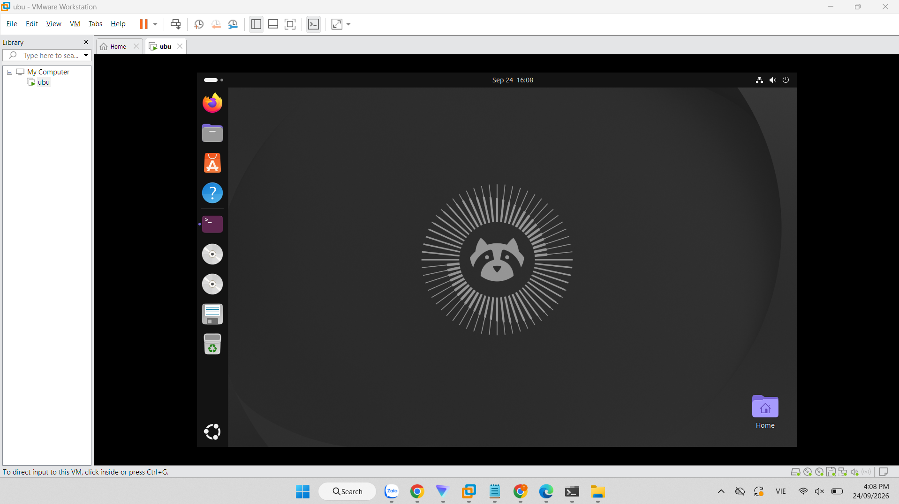
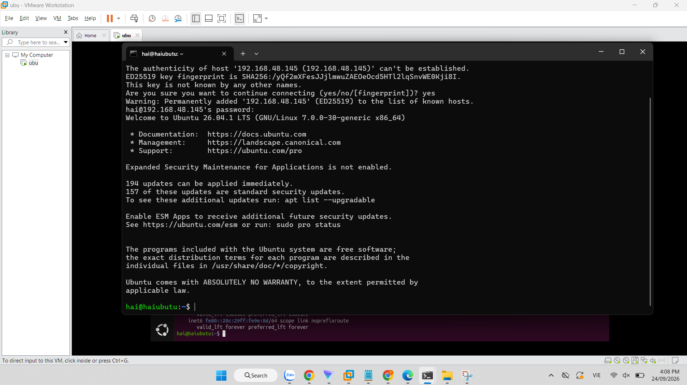
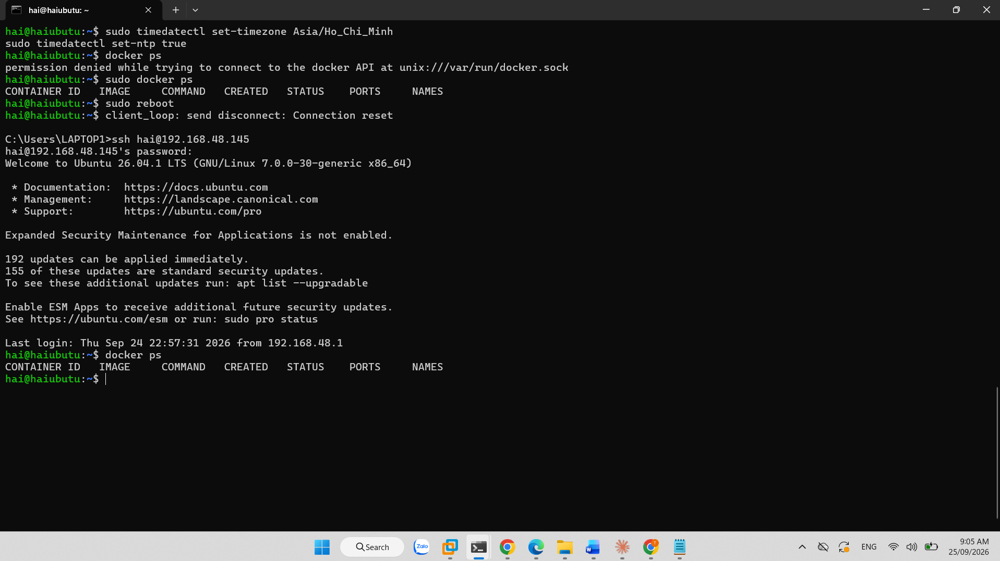
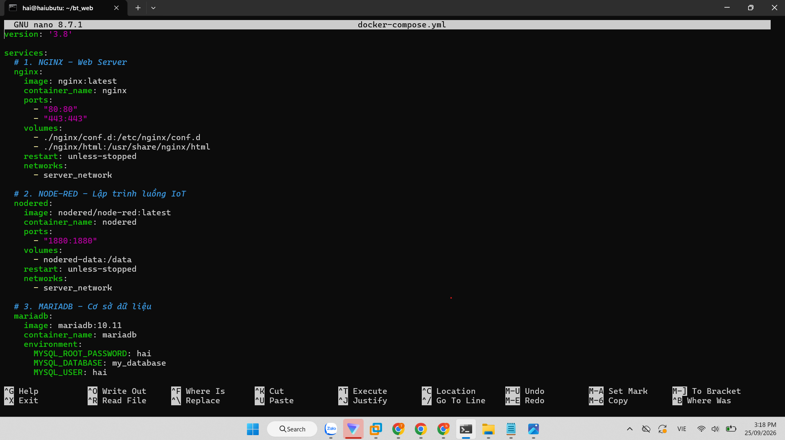

# Bài tập về nhà môn Lập trình web:

#### Họ và tên: Từ Văn Hải

#### Lớp: K59.KMT.K01

## Bài tập 1:

Cài đặt Ubutu trên máy ảo 

SSH vào máy ảo qua CMD

Cài đặt docker

Cài đặt các dịch vụ docker: nginx, nodered, mariadb, phpmyadmin, cloudflared

